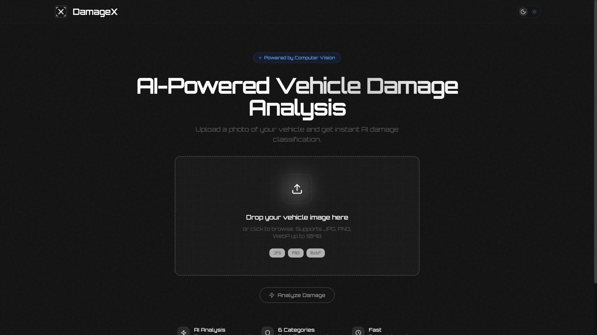
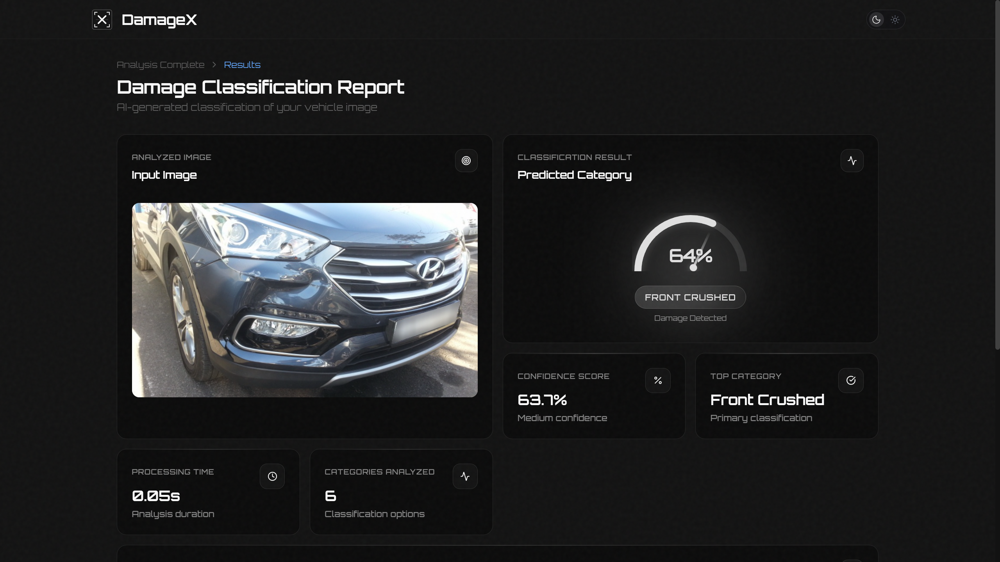
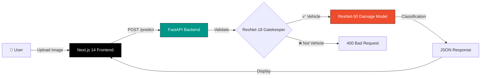

<div align="center">

# 🚗 DamageX

### AI-Powered Vehicle Damage Analysis System

[](/)
[](https://nextjs.org/)
[](https://fastapi.tiangolo.com/)
[](https://pytorch.org/)
[](https://docker.com/)

<p align="center">
  <strong>Enterprise-grade AI system for detecting and classifying vehicle damage with high precision</strong>
</p>

<br />



<br />

</div>

---

## ✨ Features

<table>
<tr>
<td width="50%">

### 🔍 Intelligent Analysis

- **Real-time Processing** — Instant damage classification in under 100ms
- **6-Class Detection** — Identifies Front/Rear Breakage, Crushed, and Normal states
- **High Accuracy** — Fine-tuned ResNet-50 model trained on vehicle damage dataset

</td>
<td width="50%">

### 🛡️ Smart Validation

- **Vehicle Detection Gate** — ResNet-18 gatekeeper rejects non-vehicle images
- **Confidence Scoring** — Detailed probability breakdown for each classification
- **Error Prevention** — Prevents hallucinations from random uploads

</td>
</tr>
</table>

<br />

<div align="center">



_Comprehensive damage classification report with confidence metrics_

</div>

---

## 🏗️ Architecture



<br />

## 🚀 Quick Start

### Using Docker (Recommended)

```bash
# Clone the repository
git clone https://github.com/yourusername/damagex.git
cd damagex

# Start all services
docker compose up --build -d

# Access the application
# 🌐 App:      http://localhost:3000
# 📚 API Docs: http://localhost:8000/docs
```

### Local Development

<details>
<summary><strong>Backend Setup (Python)</strong></summary>

```bash
cd backend

# Create virtual environment
python -m venv venv
source venv/bin/activate  # On Windows: venv\Scripts\activate

# Install dependencies
pip install -r requirements.txt

# Start the server
uvicorn app.main:app --reload --port 8001
```

</details>

<details>
<summary><strong>Frontend Setup (Node.js)</strong></summary>

```bash
cd web

# Install dependencies
npm install

# Create environment file
echo "NEXT_PUBLIC_API_URL=http://localhost:8001/api/v1/predict/" > .env.local

# Start development server
npm run dev
```

</details>

> **💡 Tip:** Docker Compose uses port `8000` for the API, while local development uses `8001` to allow running both simultaneously.

---

## 📁 Project Structure

```
damagex/
├── 🐳 docker-compose.yml     # Container orchestration
├── 📖 README.md
│
├── 🔧 backend/               # FastAPI Application
│   ├── app/
│   │   ├── main.py           # Application entry point
│   │   ├── api/v1/           # API endpoints
│   │   ├── services/         # ML model & gatekeeper logic
│   │   └── schemas/          # Pydantic models
│   ├── model/
│   │   └── saved_model.pth   # Trained ResNet-50 weights
│   └── requirements.txt
│
├── 🎨 web/                   # Next.js 14 Application
│   ├── app/                  # App router pages
│   ├── components/           # React components
│   │   ├── ui/               # Shadcn UI components
│   │   └── hooks/            # Custom React hooks
│   └── public/               # Static assets
│
└── 📊 training/              # Model Training
    ├── damage_detection.ipynb
    ├── hyperparameter_tunning.ipynb
    └── dataset/              # Training images
        ├── F_Breakage/
        ├── F_Crushed/
        ├── F_Normal/
        ├── R_Breakage/
        ├── R_Crushed/
        └── R_Normal/
```

---

## 🎯 API Reference

### Predict Endpoint

```http
POST /api/v1/predict/
Content-Type: multipart/form-data
```

| Parameter | Type   | Description                          |
| --------- | ------ | ------------------------------------ |
| `file`    | `File` | Vehicle image (JPG, PNG, WebP ≤10MB) |

#### Success Response

```json
{
  "predicted_class": "F_Crushed",
  "confidence": 0.637,
  "all_probabilities": {
    "F_Breakage": 0.082,
    "F_Crushed": 0.637,
    "F_Normal": 0.045,
    "R_Breakage": 0.112,
    "R_Crushed": 0.089,
    "R_Normal": 0.035
  },
  "processing_time": 0.05
}
```

---

## 🛠️ Tech Stack

<table>
<tr>
<td align="center" width="20%">

**Frontend**

</td>
<td align="center" width="20%">

**Backend**

</td>
<td align="center" width="20%">

**ML/AI**

</td>
<td align="center" width="20%">

**DevOps**

</td>
<td align="center" width="20%">

**UI/UX**

</td>
</tr>
<tr>
<td align="center">

Next.js 14<br/>
React 18<br/>
TypeScript<br/>
Tailwind CSS

</td>
<td align="center">

FastAPI<br/>
Python 3.11<br/>
Pydantic<br/>
Uvicorn

</td>
<td align="center">

PyTorch<br/>
TorchVision<br/>
ResNet-50<br/>
ResNet-18

</td>
<td align="center">

Docker<br/>
Docker Compose<br/>
GitHub Actions<br/>
Health Checks

</td>
<td align="center">

Framer Motion<br/>
Radix UI<br/>
Lucide Icons<br/>
Dark Mode

</td>
</tr>
</table>

---

## 📊 Model Performance

| Class          | Precision | Recall | F1-Score |
| -------------- | --------- | ------ | -------- |
| Front Breakage | 0.89      | 0.87   | 0.88     |
| Front Crushed  | 0.91      | 0.93   | 0.92     |
| Front Normal   | 0.95      | 0.94   | 0.94     |
| Rear Breakage  | 0.88      | 0.86   | 0.87     |
| Rear Crushed   | 0.90      | 0.91   | 0.90     |
| Rear Normal    | 0.94      | 0.95   | 0.94     |

---

## 🤝 Contributing

Contributions are welcome! Please feel free to submit a Pull Request.

1. Fork the repository
2. Create your feature branch (`git checkout -b feature/AmazingFeature`)
3. Commit your changes (`git commit -m 'Add some AmazingFeature'`)
4. Push to the branch (`git push origin feature/AmazingFeature`)
5. Open a Pull Request

---

## 📄 License

This project is licensed under the MIT License - see the [LICENSE](LICENSE) file for details.

---

<div align="center">

**[⬆ Back to Top](#-damagex)**

Made with ❤️ for smarter vehicle damage assessment

</div>
